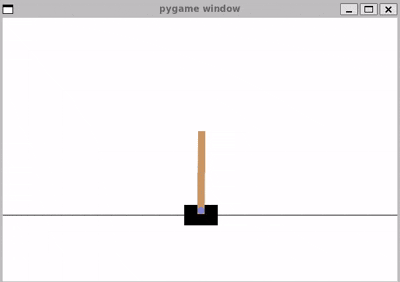

# Deep Q-Network Agent cho Flappy Bird & CartPole

Dự án này là một triển khai của thuật toán Deep Q-Learning (DQN) được thiết kế để huấn luyện một agent (tác nhân) thông minh có khả năng chơi game trong các môi trường của [Gymnasium](https://gymnasium.farama.org/), cụ thể là **Flappy Bird** và **CartPole-v1**.

Dự án không chỉ triển khai DQN tiêu chuẩn mà còn tích hợp các cải tiến quan trọng như **Double DQN** và **Dueling DQN** để tăng cường hiệu suất và sự ổn định của quá trình học.




## Mục lục
* [Tính năng chính](#tính-năng-chính)
* [Tổng quan về Môi trường](#tổng-quan-về-môi-trường)
    * [Flappy Bird](#1-flappy-bird)
    * [CartPole-v1](#2-cartpole-v1)
* [Kiến trúc và Nguyên lý hoạt động](#kiến-trúc-và-nguyên-lý-hoạt-động)
    * [Nền tảng: Deep Q-Network (DQN)](#nền-tảng-deep-q-network-dqn)
    * [Cải tiến 1: Double DQN](#cải-tiến-1-double-dqn)
    * [Cải tiến 2: Dueling DQN](#cải-tiến-2-dueling-dqn)
    * [Các kỹ thuật cốt lõi khác](#các-kỹ-thuật-cốt-lõi-khác)
* [Kết quả](#kết-quả)
* [Cài đặt](#cài-đặt)
* [Hướng dẫn sử dụng](#hướng-dẫn-sử-dụng)
    * [Huấn luyện Agent](#huấn-luyện-agent)
    * [Theo dõi bằng TensorBoard](#theo-dõi-bằng-tensorboard)
    * [Kiểm thử Agent đã huấn luyện](#kiểm-thử-agent-đã-huấn-luyện)
    * [Chơi game thủ công](#chơi-game-thủ-công)
* [Cấu trúc thư mục](#cấu-trúc-thư-mục)
* [Tài liệu tham khảo](#tài-liệu-tham-khảo)

## Tính năng chính

* **Các thuật toán hiện đại:** Triển khai DQN, Double DQN và Dueling DQN.
* **Hỗ trợ đa môi trường:** Dễ dàng huấn luyện và kiểm thử trên cả Flappy Bird và CartPole-v1.
* **Cấu hình linh hoạt:** Quản lý toàn bộ siêu tham số (hyperparameters) qua file `hyperparameters.yaml`.
* **Theo dõi trực quan:** Tích hợp sẵn TensorBoard để theo dõi quá trình học (loss, reward, epsilon...).
* **Lưu và tải mô hình:** Tự động lưu checkpoint và model tốt nhất, cho phép tạm dừng và tiếp tục huấn luyện bất cứ lúc nào.

## Tổng quan về Môi trường

### 1. Flappy Bird

**Flappy Bird** là một trò chơi arcade kinh điển, nơi người chơi điều khiển một con chim vượt qua các chướng ngại vật là những đường ống.

* **Mục tiêu:** Bay qua càng nhiều cặp ống càng tốt để tối đa hóa điểm số.
* **Thách thức:** Chỉ với một hành động "vỗ cánh" (flap), người chơi phải chống lại trọng lực và tránh va chạm vào ống, mặt đất hoặc bay quá cao.

| Thuộc tính RL   | Mô tả                                                                                                                  |
| :-------------- | :--------------------------------------------------------------------------------------------------------------------- |
| **State** | Một vector bao gồm: độ cao của chim, vận tốc rơi, khoảng cách tới cặp ống tiếp theo, độ cao của ống trên và ống dưới.     |
| **Actions** | `0` (Không làm gì), `1` (Vỗ cánh).                                                                                      |
| **Reward** | + Phần thưởng dương nhỏ cho mỗi frame tồn tại.<br>+ Phần thưởng lớn khi vượt qua một ống.<br>+ Phần thưởng âm lớn khi thua. |

### 2. CartPole-v1

**CartPole** là một môi trường benchmark tiêu chuẩn trong lĩnh vực Học tăng cường (RL).

* **Mục tiêu:** Giữ một cây sào (pole) đứng thẳng trên một chiếc xe (cart) di chuyển trong thời gian lâu nhất có thể.
* **Thách thức:** Trò chơi kết thúc khi cây sào nghiêng quá 15 độ hoặc xe di chuyển ra khỏi giới hạn màn hình.

| Thuộc tính RL   | Mô tả                                                                                                        |
| :-------------- | :----------------------------------------------------------------------------------------------------------- |
| **State** | Một vector 4 chiều: vị trí xe, vận tốc xe, góc của sào, và vận tốc góc của sào.                                  |
| **Actions** | `0` (Đẩy xe sang trái), `1` (Đẩy xe sang phải).                                                               |
| **Reward** | `+1` cho mỗi bước thời gian mà cây sào vẫn còn đứng thẳng trong giới hạn cho phép.                               |

---

## Kiến trúc và Nguyên lý hoạt động

Dự án sử dụng mạng nơ-ron sâu để xấp xỉ hàm **Q-function** $Q(s, a)$, có nhiệm vụ dự đoán tổng phần thưởng chiết khấu trong tương lai (quality) khi thực hiện hành động $a$ tại trạng thái $s$.

### Nền tảng: Deep Q-Network (DQN)

Thay vì dùng một bảng Q-table (bất khả thi với không gian trạng thái lớn), DQN sử dụng một mạng nơ-ron để học hàm $Q(s, a; \theta)$ với $\theta$ là trọng số của mạng. Mạng này được huấn luyện bằng cách tối thiểu hóa sai số (Mean Squared Error) giữa giá trị Q dự đoán và giá trị Q mục tiêu.

> **Phương trình Bellman (cốt lõi):**
> $$Q^*(s, a) = \mathbb{E}_{s' \sim \mathcal{E}} [r + \gamma \max_{a'} Q^*(s', a') | s, a]$$
> Trong đó $\gamma$ là yếu tố chiết khấu, quyết định tầm quan trọng của phần thưởng tương lai.

### Cải tiến 1: Double DQN

DQN tiêu chuẩn có xu hướng đánh giá quá cao (overestimate) Q-values. Double DQN khắc phục điều này bằng cách tách biệt việc **lựa chọn** hành động tốt nhất và **đánh giá** giá trị của hành động đó.
1.  **Policy Network** ($\theta$): Chọn hành động tốt nhất cho trạng thái tiếp theo $s'$.
2.  **Target Network** ($\theta^-$): Đánh giá giá trị của hành động đã được Policy Network chọn.

> **Công thức mục tiêu của Double DQN:**
> $$y_{\text{target}}^{\text{DoubleDQN}} = r + \gamma Q\left(s', \arg\max_{a'} Q(s', a'; \theta); \theta^-\right)$$

### Cải tiến 2: Dueling DQN

Kiến trúc Dueling DQN (triển khai trong `dqn.py`) chia mạng thành hai luồng (stream) độc lập để học hiệu quả hơn:
1.  **Value Stream $V(s)$:** Ước tính giá trị chung của một trạng thái (trạng thái này tốt đến mức nào?).
2.  **Advantage Stream $A(s, a)$:** Ước tính lợi thế của mỗi hành động so với các hành động khác tại trạng thái đó.

Hai luồng này được kết hợp để tạo ra Q-value cuối cùng, giúp mô hình hiểu giá trị của trạng thái mà không phụ thuộc vào hành động.

> **Công thức kết hợp:**
> $$Q(s, a) = V(s) + \left( A(s, a) - \frac{1}{|\mathcal{A}|} \sum_{a' \in \mathcal{A}} A(s, a') \right)$$

### Các kỹ thuật cốt lõi khác

* **Experience Replay** (`experience_replay.py`): Một bộ nhớ đệm lưu trữ các transition `(state, action, reward, next_state)`. Việc lấy các lô (mini-batch) ngẫu nhiên từ bộ nhớ này giúp phá vỡ sự tương quan giữa các kinh nghiệm liên tiếp và ổn định quá trình học.
* **Target Network**: Một bản sao của mạng chính với trọng số được cập nhật từ từ (soft update). Mạng này cung cấp một mục tiêu ổn định trong quá trình tính toán loss, tránh sự dao động và phân kỳ.

## Kết quả

*(Phần này là nơi bạn có thể thêm các biểu đồ từ TensorBoard hoặc ảnh GIF về kết quả của agent đã được huấn luyện.)*

**Ví dụ: Biểu đồ phần thưởng trên CartPole-v1**

*Agent cho CartPole-v1 đạt được điểm số trung bình là 495.0 trong 100 episodes cuối cùng sau khi huấn luyện.*

## Cài đặt

### Điều kiện tiên quyết
* Python 3.8+
* Pip

### Hướng dẫn cài đặt
1.  **Clone repository:**
    ```bash
    git clone <your-repo-url>
    cd <your-repo-folder>
    ```

2.  **Tạo và kích hoạt môi trường ảo (khuyến khích):**
    ```bash
    python -m venv venv
    # Linux/macOS
    source venv/bin/activate
    # Windows
    venv\Scripts\activate
    ```

3.  **Cài đặt các thư viện cần thiết:**
    ```bash
    pip install -r requirements.txt
    ```

## Hướng dẫn sử dụng

### Huấn luyện Agent

Để bắt đầu huấn luyện, chạy `agent.py` với tên cấu hình (từ `hyperparameters.yaml`) và cờ `--train`.

> **Lưu ý:** Quá trình huấn luyện có thể được dừng (Ctrl+C) và tiếp tục bất cứ lúc nào bằng cách chạy lại cùng một lệnh. Chương trình sẽ tự động tải checkpoint mới nhất từ thư mục `runs/`.

* **Huấn luyện cho Flappy Bird:**
    ```bash
    python agent.py FlappyBird-v0 --train
    ```

* **Huấn luyện cho CartPole:**
    ```bash
    python agent.py CartPole-v1 --train
    ```

### Theo dõi bằng TensorBoard

Trong khi huấn luyện, mở một terminal khác và chạy lệnh sau để khởi động TensorBoard:
```bash
tensorboard --logdir=runs
```
Sau đó hãy truy cập vào https://localhost:6006/ trên trình duyệt để xem qua các biểu đồ trực quan.

### Kiểm thử Agent đã huấn luyện
Để chạy agent đã huấn luyện ở chế độ render (có đồ họa), chỉ cần chạy `agent.py` mà không có cờ `--train`.

Chương trình sẽ tự động tải model tốt nhất đã được lưu.

* **Kiểm thử agent Flappy Bird:**
    ```bash
    python agent.py FlappyBird-v0
    ```
* **Kiểm thử agent CartPole:**
    ```bash
    python agent.py CartPole-v1
    ```

### Chơi game thủ công
Để hiểu rõ hơn về môi trường Flappy Bird, bạn có thể tự chơi bằng cách chạy:
```bash
python flappybird_testing.py
```
Sử dụng phím **Space** để điều khiển

---

## Cấu trúc thư mục
```
.
├── agent.py                 # Logic chính của agent, vòng lặp huấn luyện và kiểm thử
├── dqn.py                   # Định nghĩa kiến trúc mạng (DQN, Dueling DQN)
├── experience_replay.py     # Lớp ReplayMemory để lưu trữ kinh nghiệm
├── hyperparameters.yaml     # File cấu hình các siêu tham số cho từng môi trường
├── flappybird_testing.py    # Script để chơi Flappy Bird thủ công
├── requirements.txt         # Các thư viện Python cần thiết
└── runs/                    # Thư mục tự động tạo để lưu kết quả (model, log, tensorboard)
```

---

## Tài liệu tham khảo
1.  **Deep Q-Network (DQN):**
    > Mnih, V., et al. (2015). Human-level control through deep reinforcement learning. *Nature*.

2.  **Dueling DQN:**
    > Wang, Z., et al. (2016). Dueling network architectures for deep reinforcement learning. *International conference on machine learning*.

3.  **Double DQN:**
    > Van Hasselt, H., Guez, A., & Silver, D. (2016). Deep reinforcement learning with double q-learning. *AAAI Conference on Artificial Intelligence*.
